# Jambonz Local PoC - Configuration & Setup Documentation

This document serves as a comprehensive Proof of Concept (PoC) reference for deploying Jambonz locally using Docker Compose. It documents the UI-created configuration, explains how system components integrate, and captures all setup challenges encountered and resolved during deployment.

---

## Table of Contents

1. [Repository Overview](#repository-overview)
2. [System Architecture](#system-architecture)
3. [Prerequisites](#prerequisites)
4. [Installation & Setup](#installation--setup)
5. [Component Configuration](#component-configuration)
6. [Testing Your Deployment](#testing-your-deployment)
7. [Troubleshooting & Common Issues](#troubleshooting--common-issues)
8. [Detailed Issue Resolutions](#detailed-issue-resolutions)
9. [Debugging Reference](#debugging-reference)
10. [Webhook Development Issues](#webhook-development-issues)
11. [File Reference](#file-reference)

---

## Repository Overview

**What this repository provides:**  
A complete local deployment of [Jambonz](https://www.jambonz.org/), an open-source CPaaS (Communications Platform as a Service) that enables programmable voice and messaging applications via webhooks and JSON-based call control.

**PoC Scope:**  
- Full Jambonz microservices stack (**13 containers**) running via Docker Compose
- Pre-seeded MySQL database with default service provider, account, applications, and SIP users
- SIP client registration (MicroSIP) with interactive speech recognition demos
- Inbound call routing from local SIP clients to Jambonz applications
- Custom webhook development with TTS and STT capabilities

---

## System Architecture

### Architecture Diagram

```mermaid
graph TB
    subgraph External["External Network"]
        PSTN["PSTN/Carrier"]
        SIP_CLIENTS["SIP Clients<br/>(MicroSIP)"]
    end
    
    subgraph SBC["SBC Layer"]
        RTPENGINE["rtpengine:22222"]
        SBC_SIDECAR["sbc-sip-sidecar"]
        SBC_INBOUND["sbc-inbound:4000"]
        SBC_ROUTER["sbc-call-router"]
        SBC_OUTBOUND["sbc-outbound:4001"]
    end
    
    subgraph FS["Feature Server Layer"]
        DRACHTIO_FS["drachtio-feature:9023"]
        FEATURE_SERVER["feature-server:3000"]
        FREESWITCH["FreeSWITCH:8021"]
    end
    
    subgraph APP["Application Layer"]
        API_SERVER["api-server:3000"]
        WEBAPP["webapp:3001"]
        WEBHOOK["webhook:3002"]
    end
    
    subgraph DATA["Data Layer"]
        MYSQL["MySQL"]
        REDIS["Redis"]
        INFLUXDB["InfluxDB"]
    end
    
    %% External connections
    PSTN --> SBC_INBOUND
    SIP_CLIENTS --> SBC_INBOUND
    SIP_CLIENTS -.-> SBC_SIDECAR
    
    %% SBC Layer connections
    SBC_INBOUND --> RTPENGINE
    SBC_INBOUND --> SBC_ROUTER
    SBC_ROUTER --> SBC_OUTBOUND
    SBC_ROUTER --> FEATURE_SERVER
    SBC_OUTBOUND --> RTPENGINE
    
    %% Feature Server connections
    DRACHTIO_FS --> FEATURE_SERVER
    FEATURE_SERVER --> FREESWITCH
    FEATURE_SERVER --> WEBHOOK
    
    %% Application Layer connections
    FEATURE_SERVER --> API_SERVER
    WEBAPP --> API_SERVER
    
    %% Data Layer connections
    FEATURE_SERVER --> MYSQL
    FEATURE_SERVER --> REDIS
    FEATURE_SERVER --> INFLUXDB
    API_SERVER --> MYSQL
    API_SERVER --> REDIS
    SBC_INBOUND --> MYSQL
    SBC_INBOUND --> REDIS
    
    style External fill:#1a1a2e
    style SBC fill:#16213e
    style FS fill:#0f3460
    style APP fill:#533483
    style DATA fill:#9b59b6
```



### Service Overview

**13 Microservices orchestrated by Docker Compose:**

| Service | Purpose | Ports Exposed |
|---------|---------|---------------|
| `mysql` | Persistent database (schema + seed data) | - |
| `redis` | Session state & caching | - |
| `influxdb` | Time-series metrics | - |
| `drachtio` | Main SIP server (SBC entry point) | **5060/udp, 5060/tcp**, 9022 |
| `feature-server-drachtio` | Dedicated SIP server for feature server | - |
| `freeswitch` | Media server (TTS, recording, conferencing) | 8021, 30000-30100/udp |
| `rtpengine` | RTP proxy for media relay | 22222/udp, 40000-40100/udp |
| `sbc-inbound` | Handles inbound SIP calls | - |
| `sbc-outbound` | Handles outbound SIP calls | - |
| `sbc-call-router` | Routes calls to feature servers | - |
| `sbc-sip-sidecar` | SIP device registration | - |
| `feature-server` | Executes Jambonz applications | 3100 |
| `api-server` | REST API for management | **3000** |
| `webapp` | Admin UI | **3001** |
| `webhook` | Custom webhook application (optional) | **3002** |

---

## Prerequisites

### System Requirements

- **Operating System**: Windows 10/11, Linux, or macOS
- **RAM**: Minimum 8GB (16GB recommended)
- **Disk Space**: 10GB free space
- **Network**: Local network with static or known IP address

### Required Software

1. **Docker Desktop** (Windows/macOS) or **Docker Engine** (Linux)
   - Version 20.10 or higher
   - Docker Compose V2 included

2. **Git** (for cloning repositories)

3. **SIP Softphone** (for testing)
   - Recommended: [MicroSIP](https://www.microsip.org/) (Windows)
   - Alternatives: Linphone, Zoiper, or any standards-compliant SIP client

### Network Configuration

You'll need to know your computer's **LAN IP address**:

**Windows:**
```powershell
ipconfig
# Look for "IPv4 Address" under your active network adapter
# Example: 192.168.1.45
```

**Linux/macOS:**
```bash
ip addr show
# or
ifconfig
# Look for inet address on your primary interface
```

---

## Installation & Setup

### Step 1: Obtain Your LAN IP Address

Before starting, identify your machine's LAN IP (you'll need this for configuration):

```powershell
# Windows
ipconfig | findstr IPv4

# Expected output example:
#   IPv4 Address. . . . . . . . . . . : 192.168.1.45
```

**Note this IP address** - you'll use it in Step 4.

---

### Step 2: Clone the Repository

```bash
# Clone the repository
git clone https://github.com/yourusername/jambonz-local-poc
cd jambonz-local-poc
```

---

### Step 3: Configure Drachtio SIP Server

Edit `drachtio.conf.xml` and update the `external-ip` with your LAN IP from Step 1:

```xml
<drachtio>
    <admin port="9022" secret="cymru">0.0.0.0</admin>
    <sip>
        <contacts>
            <!-- REPLACE 192.168.1.45 with YOUR LAN IP -->
            <contact external-ip="192.168.1.45" local-net="172.18.0.0/16">
                sip:*:5060;transport=udp,tcp
            </contact>
        </contacts>
    </sip>
    <logging>
        <loglevel>debug</loglevel>
        <sofia-loglevel>3</sofia-loglevel>
    </logging>
</drachtio>
```

**Why this matters:** Drachtio needs to know your external IP for proper SIP header rewriting and NAT traversal.

---

### Step 4: (Windows Only) Configure Firewall

Allow SIP and RTP traffic through Windows Firewall:

```powershell
# Open PowerShell as Administrator and run:

# Allow SIP signaling
New-NetFirewallRule -DisplayName "Jambonz SIP UDP" -Direction Inbound -Protocol UDP -LocalPort 5060 -Action Allow
New-NetFirewallRule -DisplayName "Jambonz SIP TCP" -Direction Inbound -Protocol TCP -LocalPort 5060 -Action Allow

# Allow RTP media
New-NetFirewallRule -DisplayName "Jambonz FreeSWITCH RTP" -Direction Inbound -Protocol UDP -LocalPort 30000-30100 -Action Allow
New-NetFirewallRule -DisplayName "Jambonz RTPEngine RTP" -Direction Inbound -Protocol UDP -LocalPort 40000-40100 -Action Allow
```

---

### Step 5: Start Jambonz Stack

```bash
# Pull latest images and start all services
docker-compose up -d

# Verify all containers are running
docker-compose ps

# You should see 13 containers with STATUS "Up"
```

**Initial startup** takes 2-3 minutes. Services start in dependency order:
1. MySQL, Redis, InfluxDB (data layer)
2. Drachtio, FreeSWITCH, RTPEngine (media layer)
3. SBC components, Feature Server
4. API Server, WebApp

---

### Step 6: Verify Database Initialization

Check that the database was seeded correctly:

```bash
# Check MySQL initialization logs
docker logs jambonz-mysql | grep "ready for connections"

# Should show the server is ready
```

---

### Step 7: Access Web UI

1. Open browser: **http://localhost:3001**
2. Login with default credentials:
   - **Email**: `joe@foo.bar`
   - **Password**: `admin`
3. You'll be prompted to change the password on first login

---

### Step 8: Configure Google Cloud Credentials (For STT)

For speech recognition to work, mount your Google Cloud service account JSON:

1. Place your GCP credentials file in the repository root
2. The `docker-compose.yaml` already mounts it:
   ```yaml
   feature-server:
     volumes:
       - ./aumne-act-ccaas-internal-e79b1e3e9988.json:/opt/credentials/gcp.json
     environment:
       GOOGLE_APPLICATION_CREDENTIALS: /opt/credentials/gcp.json
   ```

---

### Step 9: Configure MicroSIP Client

1. **Download and install** MicroSIP
2. **Add new account** with these settings:

| Setting | Value |
|---------|-------|
| Account Name | Jambonz |
| SIP Server | `sip.jambonz.local` |
| SIP Proxy | `YOUR_LAN_IP` (from Step 1) |
| Username | `1001` |
| Login | `1001` |
| Password | `password` |
| Domain | `sip.jambonz.local` |
| Transport | UDP |

3. **Save and Enable** the account
4. Wait for **green status** (Registered)

---

### Step 10: Make Your First Test Call

1. In MicroSIP, dial **any number** (e.g., `1002`, `9999`, `5551234`)
2. You should hear: *"Hello! Welcome to the Jambonz interactive demo."*
3. Speak your name when prompted
4. The system will repeat it back to you
5. Call disconnects automatically

**If you hear the greeting** - Congratulations! 🎉 Your Jambonz deployment is working!

---

## Testing Your Deployment

### Verification Checklist

✅ **All containers running:**
```bash
docker-compose ps
# All 13 services should show "Up"
```

✅ **Feature Server connected:**
```Bash
docker logs jambonz-feature-server | grep "connected to drachtio"
# Should show connection to feature-server-drachtio (sidecar)
```

✅ **SIP registration successful:**
- MicroSIP shows green status
- Can make calls

✅ **Speech recognition working:**
- Webhook captures and repeats your speech
- Check logs: `docker logs jambonz-webhook --tail 50`

---

## Component Configuration

### Database Seed Script (`init-db.sql`)

The `init-db.sql` file is mounted into MySQL and executed on first container start. It contains:

- **Complete Jambonz schema** (cloned from `jambonz-api-server/db/jambones-sql.sql`)
- **Pre-configured seed data:**
  - Service provider: `default service provider`
  - Account: `default account`
  - Applications: `local-webhook`, `dial time`
  - Webhooks pointing to `https://public-apps.jambonz.cloud/` or local webhook
  - Admin user: `joe@foo.bar` / password: `admin`
  - API keys for programmatic access
  - Predefined carriers (Twilio, Voxbone, Simwood, TelecomsXChange)

### UI Configuration Reference

The following configurations were created via the Jambonz web UI and are pre-seeded in the database:

#### Account Configuration

```yaml
account:
  name: default account
  max_calls: 0              # 0 = unlimited
  sip_realm: sip.jambonz.local
  webhook_secret: wh_secret_cJqgtMDPzDhhnjmaJH6Mtk
  sip_application:
    name: local-webhook
    purpose: inbound SIP device calls
```

#### System Settings

```yaml
system:
  domain_name: jambonz.local
  sip_domain_name: sip.jambonz.local
  private_network_cidr: 172.18.0.0/16
  monitoring_domain_name: monitoring.jambonz.local
  log_level: debug
  admin_type: service_provider
```

#### SIP Users (Clients)

```yaml
sip_users:
  - username: "1001"
    password: "password"
  - username: "1002"
    password: "password"
```

> SIP registration domain: `sip:sip.jambonz.local`

#### Application Configuration

```yaml
application:
  name: local-webhook
  account: default account

  calling_webhook:
    url: http://webhook:3002/call
    method: POST
    auth: none

  call_status_webhook:
    url: http://webhook:3002/call-status
    method: POST
    auth: none


  speech_synthesis:
    vendor: elevenlabs  # or google
    language: en-US

  speech_recognition:
    vendor: google
    language: en-US
```

#### Speech Services Configuration (UI)

Jambonz requires speech services to be configured for TTS (Text-to-Speech) and STT (Speech-to-Text). Configure these in the web UI under **Settings → Speech**.

##### Google Cloud Speech (STT Only)

**Navigation:** Settings → Speech → Add Speech Service → Google

**Configuration Fields:**

| Field | Value | Description |
|-------|-------|-------------|
| Credential Status | `online ok` | Your Google Cloud service account credential name |
| Vendor | Google | Automatically selected |
| Account | *(optional)* | Leave blank for global use |
| Label | *(optional)* | Friendly name for this credential |
| Use for TTS | ❌ Unchecked | Disable Google for text-to-speech  (optional)|
| Use for STT | ✅ Checked | Enable Google for speech-to-text |

**Service Account JSON:**
Paste your complete Google Cloud service account JSON

---

##### ElevenLabs (TTS Only)

**Navigation:** Settings → Speech → Add Speech Service → ElevenLabs

**Configuration Fields:**

| Field | Value | Description |
|-------|-------|-------------|
| Use for TTS | ✅ Checked | Enable ElevenLabs for text-to-speech |
| Data Residency | `US` | Server region for data processing |
| API Key | `sk_***********` | Your ElevenLabs API key (hidden) |
| Model | `Eleven Turbo v2` | Voice model selection |
| Enable Optimize | ✅ Checked | Enable latency optimization |

---

#### Carrier Configuration (Inbound SIP Gateway) [Optional]

```yaml
carrier:
  name: Test
  active: true

  inbound:
    allowed_ips:
      - network: 192.168.1.45   # Host machine IP
        netmask: 32

  outbound: disabled
  registration: disabled

  media:
    pad_crypto: true
```

---

## Troubleshooting & Common Issues

### Issue: MicroSIP Won't Register

**Symptoms**: Registration status stays red or shows "Forbidden"

**Solutions**:
1. ✅ Verify `drachtio.conf.xml` has your correct LAN IP
2. ✅ Check firewall allows port 5060 UDP/TCP
3. ✅ Ensure both "SIP Server" AND "SIP Proxy" are configured in MicroSIP
4. ✅ Restart Drachtio: `docker-compose restart drachtio`

---

### Issue: Call Rejected (404/403)

**Symptoms**: Call fails with "Not Found" or "Forbidden"

**Cause**: SBC can't find account because MicroSIP is sending IP instead of domain

**Solutions**:
1. **Preferred**: Set "Domain" field in MicroSIP to `sip.jambonz.local`
2. **Alternative**: Append Account SID to URI:
   ```
   sip:1002@192.168.1.45?X-Account-Sid=9351f46a-678c-43f5-b8a6-d4eb58d131af
   ```

---

### Issue: No Audio / One-Way Audio

**Symptoms**: Call connects but no sound

**Solutions**:
1. Open RTP ports in firewall (see Step 4)
2. Verify RTPEngine is running: `docker logs jambonz-rtpengine`
3. Check `external-ip` in drachtio.conf.xml matches your LAN IP

---

### Issue: Webhook Not Receiving Calls

**Symptoms**: Call hangs or errors instead of triggering webhook

**Solutions**:
1. Enable CORS in webhook:
   ```python
   from flask_cors import CORS
   CORS(app)
   ```
2. Check webhook logs: `docker logs jambonz-webhook -f`
3. Verify application configuration points to correct webhook URL

---

### Issue: "Old Code Running" in Webhook

**Symptoms**: Code changes not reflected in running webhook

**Solution**:
```bash
# Rebuild webhook Docker image
docker-compose build webhook

# Restart with new image
docker-compose up -d webhook
```

See [Section 10](#webhook-development-issues) for detailed webhook troubleshooting.

---

## Detailed Issue Resolutions

### Issue 1: Initial Minimal Setup Failure

**Problem:** Attempted to run Jambonz with only essential containers. SIP registration and call handling failed.

**Resolution:** Jambonz requires the complete microservices stack. All 13 services are interdependent:
- `sbc-sip-sidecar` handles SIP REGISTER requests
- `sbc-inbound` / `sbc-outbound` handle call routing  
- `sbc-call-router` routes to `feature-server`
- `feature-server` executes application logic
- `feature-server-drachtio` provides dedicated SIP server

**Lesson:** Do not attempt to reduce the container count—each microservice has a specific responsibility.

---

### Issue 2: Proper Database Seeding

**Problem:** Empty database caused UI to fail loading, and manually created configurations lacked proper foreign key relationships.

**Resolution:** Cloned the complete schema from `jambonz-api-server/db/jambones-sql.sql` and merged it with seed data. The combined `init-db.sql` creates all required tables with proper indexes, foreign keys, and default configurations.

**Lesson:** Use the official Jambonz-api-server schema as source of truth for database structure.

---

### Issue 3: Port Exposure and Drachtio Entry Point

**Problem:** SIP clients could not reach Jambonz from the host network.

**Resolution:** Drachtio is the **only SIP entry point** and must expose ports 5060/udp, 5060/tcp, and 9022.

**Lesson:** Drachtio handles all external SIP traffic—no other containers need SIP ports exposed.

---

### Issue 4: Windows Firewall Permissions

**Problem:** SIP traffic blocked by Windows Firewall even with correct port exposure.

**Resolution:** Create explicit inbound firewall rules (see Step 4 in Installation).

**Lesson:** Windows firewall operates independently of Docker port mapping.

---

### Issue 5: Drachtio External IP Configuration

**Problem:** SIP clients received responses with internal Docker IPs, causing registration failures.

**Resolution:** Set `external-ip="YOUR_LAN_IP"` in drachtio.conf.xml to enable proper NAT traversal.

**Lesson:** Update external-ip whenever the host's IP changes.

---

### Issue 6: MicroSIP Domain + Proxy Configuration

**Problem:** MicroSIP failed to register when only SIP Server was set.

**Resolution:** Configure BOTH:
- `SIP Server`: `sip.jambonz.local` (used in SIP headers)
- `SIP Proxy`: `192.168.1.45` (actual IP to send packets to)

**Lesson:** For non-DNS-resolvable domains, configure both domain name and proxy IP.

---

### Issue 7: Feature Server Routing Loop

**Problem:** Calls failed with "603 Decline" and "no outbound carriers found" error. Webhook was never invoked.

**Root Cause:** Sharing a single Drachtio instance between SBCs and Feature Server created a routing loop.

**Resolution:** Implemented dedicated `feature-server-drachtio` sidecar container.

**Architecture Change:**
```diff
Before (Shared Drachtio):
  ┌──────────┐
  │drachtio  │ ← Used by SBCs AND Feature Server
  │(shared)  │   (causes routing loop)
  └──────────┘

After (Sidecar Pattern):
  ┌──────────┐           ┌─────────────────────┐
  │drachtio  │ ← SBCs    │feature-server-      │ ← Feature Server
  │(main)    │           │drachtio (sidecar)   │   (isolated routing)
  └──────────┘           └─────────────────────┘
```

**Lesson:** Feature Server must have its own Drachtio sidecar to isolate application logic routing from SBC routing.

---

## Debugging Reference

### Viewing Logs

```bash
# Real-time logs from all services
docker-compose logs -f

# Specific service logs
docker logs jambonz-feature-server --tail 100
docker logs jambonz-sbc-inbound --tail 100
docker logs jambonz-webhook --tail 50

# Search for specific call-id
docker-compose logs | grep "CALL_ID_HERE"

# Check Feature Server connection
docker logs jambonz-feature-server | grep "connected to drachtio"
```

### Common SIP Headers

```
X-Jambonz-Routing: app     → Routes to Feature Server (webhook application)
X-Jambonz-Routing: sip     → Routes as standard SIP call (peer-to-peer)
```

**Forcing Application Logic:**
- Dial a non-user number (e.g., `9999`)
- Set `allow_direct_user_calling=0` in `clients` table
- Assign a DID to the application

### Architecture Validation

✅ **Verify Drachtio Sidecar:**
```bash
docker ps | grep drachtio
# Should show TWO containers:
# - jambonz-drachtio (main, for SBCs)
# - jambonz-feature-server-drachtio (sidecar)
```

✅ **Verify Feature Server Connection:**
```bash
docker logs jambonz-feature-server 2>&1 | grep "connected to drachtio"
# Should connect to sidecar, NOT main drachtio
```

---

## Webhook Development Issues

This section documents issues encountered while developing custom webhook applications for interactive call flows with speech recognition.

### Issue 10.1: Stale Docker Image Code

**Problem:** Updated webhook code not executed. Container continued using old code.

**Cause:** Webhook uses `build: ./webhook` in docker-compose.yaml. Image was built once and cached.

**Resolution:**
```bash
# Rebuild the webhook Docker image
docker-compose build webhook

# Restart with new image
docker-compose up -d webhook

# Verify new code loaded
docker exec jambonz-webhook cat /app/app.py | head -20
```

**Development Tip:** Use volume mounts for hot-reloading:
```yaml
webhook:
  build: ./webhook
  volumes:
    - ./webhook/app.py:/app/app.py  # Direct mount
```

---

### Issue 10.2: Speech Recognition Vendor Configuration

**Problem:** Connection went "orange" after first TTS, preventing speech recognition.

**Cause:** Explicit Google STT vendor config requires valid credentials:
```python
"recognizer": {"vendor": "google", "language": "en-US"}
```

**Resolution:** Simplified to use system default:
```python
{
    "verb": "gather",
    "input": ["speech"],
    "speechTimeout": 3  # Removed explicit vendor
}
```

**Lesson:** Either configure credentials properly or omit `recognizer` to use system default.

---

### Issue 10.3: Incorrect Transcript Parsing

**Problem:** STT working but webhook said "didn't catch that."

**Cause:** Wrong parsing path. Looking for `speech.transcript` but Jambonz returns:
```json
{
  "speech": {
    "alternatives": [
      {"transcript": "hello I am Jambonz", "confidence": 0.77}
    ]
  }
}
```

**Resolution:**
```python
# Correct parsing
speech_result = result_data.get('speech', {})
alternatives = speech_result.get('alternatives', [])
transcript = alternatives[0].get('transcript', '').strip() if alternatives else ''
```

---

### Issue 10.4: Call Not Disconnecting After TTS

**Problem:** Call didn't auto-disconnect after final TTS. Users had to manually hang up.

**Cause:** Race condition - `hangup` executed before TTS audio completed.

**Resolution:** Add `pause` between `say` and `hangup`:
```python
return jsonify([
    {"verb": "say", "text": f"You said: {transcript}. Goodbye!"},
    {"verb": "pause", "length": 1},  # Ensure TTS completes
    {"verb": "hangup"}
])
```

**Recommended pause:** 0.5-1.5 seconds depending on audio length.

---

### Complete Working Webhook Example

```python
"""
Interactive Jambonz Webhook Application
Handles inbound calls with speech recognition.
"""
from flask import Flask, request, jsonify
from flask_cors import CORS
import logging

logging.basicConfig(level=logging.INFO)
logger = logging.getLogger(__name__)

app = Flask(__name__)
CORS(app)

@app.route('/call', methods=['POST'])
def handle_call():
    """Greet caller and prompt for speech input."""
    call_data = request.get_json(force=True, silent=True) or {}
    logger.info(f"Incoming call from: {call_data.get('from', 'unknown')}")
    
    return jsonify([
        {"verb": "say", "text": "Hello! Welcome to the Jambonz interactive demo."},
        {
            "verb": "gather",
            "input": ["speech"],
            "actionHook": "/gather-result",
            "timeout": 10,
            "speechTimeout": 3,
            "say": {"text": "Please tell me your name, and I will repeat it back."}
        }
    ])

@app.route('/gather-result', methods=['POST'])
def gather_result():
    """Process speech recognition result and repeat back."""
    result_data = request.get_json(force=True, silent=True) or {}
    
    # Extract transcript from alternatives array
    speech_result = result_data.get('speech', {})
    alternatives = speech_result.get('alternatives', [])
    transcript = alternatives[0].get('transcript', '').strip() if alternatives else ''
    
    if not transcript:
        return jsonify([
            {"verb": "say", "text": "Sorry, I didn't catch that. Goodbye!"},
            {"verb": "pause", "length": 1},
            {"verb": "hangup"}
        ])
    
    logger.info(f"Repeating back: {transcript}")
    return jsonify([
        {"verb": "say", "text": f"You said: {transcript}. Thank you for calling!"},
        {"verb": "pause", "length": 1},
        {"verb": "hangup"}
    ])

@app.route('/call-status', methods=['POST'])
def call_status():
    """Log call status updates."""
    status = request.get_json(force=True, silent=True) or {}
    logger.info(f"Call {status.get('call_sid')} status: {status.get('call_status')}")
    return '', 200

if __name__ == '__main__':
    app.run(host='0.0.0.0', port=3002, debug=True)
```

### Webhook Troubleshooting Quick Reference

| Symptom | Cause | Solution |
|---------|-------|----------|
| Old code running | Cached Docker image | `docker-compose build webhook` |
| Orange connection | Missing STT credentials | Remove vendor config or configure credentials |
| "Didn't catch that" | Wrong parsing path | Use `speech.alternatives[0].transcript` |
| Call doesn't disconnect | TTS/hangup race | Add 1-sec `pause` before `hangup` |
| No webhook invocation | CORS failure | Enable CORS with `flask_cors` |

---

## File Reference

| File | Purpose |
|------|---------|
| `docker-compose.yaml` | Orchestrates all 13 microservices |
| `init-db.sql` | Complete schema + seed data |
| `drachtio.conf.xml` | Main Drachtio SIP server configuration |
| `aumne-act-ccaas-internal-*.json` | Google Cloud credentials for STT |
| `configuration.md` | This documentation |
| `webhook/app.py` | Custom webhook application |
| `webhook/Dockerfile` | Webhook container build instructions |
| `webhook/requirements.txt` | Python dependencies |
| `freeswitch/log/` | FreeSWITCH log directory |

---

**Document Version:** 2.1  
**Last Updated:** 2026-01-19  
**Status:** Complete with optimized setup instructions and webhook troubleshooting
